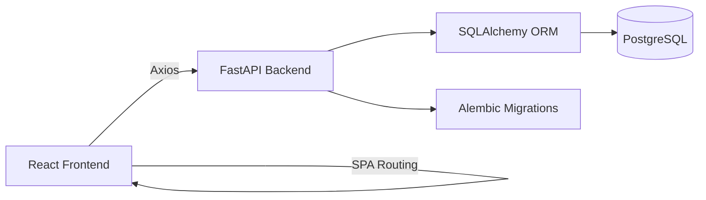

# Inventory & Order Management System

A production-ready full stack inventory and order management application built with FastAPI, SQLAlchemy, Alembic, PostgreSQL, React, React Router, Axios, React Hook Form, Tailwind CSS, Docker, and Docker Compose.

## Project Overview

This repository contains a backend API for managing products, customers, orders, and inventory updates, plus a responsive frontend for day-to-day operations.

## Features

- Product CRUD with SKU uniqueness, stock validation, search, sort, and pagination
- Customer CRUD with unique email validation and search/pagination
- Order creation with transaction-safe stock deduction and backend-calculated totals
- Inventory tracking with low stock warnings
- Dashboard stats endpoint
- Responsive React UI with modal forms, tables, loading states, error states, and toast notifications
- Dockerized local setup with PostgreSQL persistence
- Backend tests and frontend component tests
- Seed script for sample data

## Architecture Diagram



## Local Setup

### Backend

```bash
cd backend
python -m venv .venv
.venv\Scripts\activate
pip install -r requirements.txt
copy .env.example .env
alembic upgrade head
uvicorn app.main:app --reload
```

### Frontend

```bash
cd frontend
npm install
copy .env.example .env
npm run dev
```

### Full Stack with Docker

```bash
docker compose up --build
```

## Environment Variables

### Backend

- `DATABASE_URL`
- `POSTGRES_DB`
- `POSTGRES_USER`
- `POSTGRES_PASSWORD`
- `BACKEND_PORT`
- `FRONTEND_PORT`
- `CORS_ORIGINS`

### Frontend

- `VITE_API_BASE_URL`
- `VITE_APP_NAME`

## Docker Commands

```bash
docker compose up --build
docker compose down -v
```

## Deployment Guide

### Backend on Render or Railway

- Set `DATABASE_URL` to your PostgreSQL connection string.
- Run Alembic migrations during release or startup with `alembic upgrade head`.
- Expose the backend with `uvicorn app.main:app --host 0.0.0.0 --port $BACKEND_PORT`.
- Set `CORS_ORIGINS` to the deployed frontend domain.

### Frontend on Vercel or Netlify

- Set `VITE_API_BASE_URL` to the deployed backend `/api` URL.
- Build command: `npm run build`
- Output directory: `dist`

## API Documentation

Swagger UI is available at `/docs` and ReDoc at `/redoc`.

### Products

- `POST /api/products`
- `GET /api/products`
- `GET /api/products/{id}`
- `PUT /api/products/{id}`
- `DELETE /api/products/{id}`

### Customers

- `POST /api/customers`
- `GET /api/customers`
- `GET /api/customers/{id}`
- `DELETE /api/customers/{id}`

### Orders

- `POST /api/orders`
- `GET /api/orders`
- `GET /api/orders/{id}`
- `DELETE /api/orders/{id}`

### Dashboard

- `GET /api/dashboard/stats`

## Screenshots Placeholder

Add screenshots of the dashboard, product modal, customer table, and order flow here before production release.

## Testing Instructions

### Backend

```bash
cd backend
pytest
```

### Frontend

```bash
cd frontend
npm run test
```

## Seed Data

```bash
cd backend
python -m app.utils.seed
```

## Migration Commands

```bash
cd backend
alembic revision --autogenerate -m "describe change"
alembic upgrade head
```
